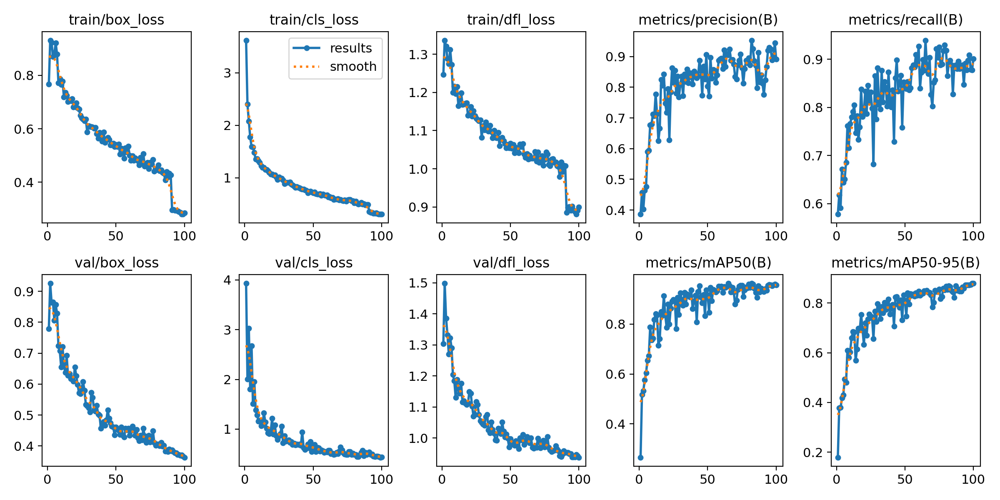
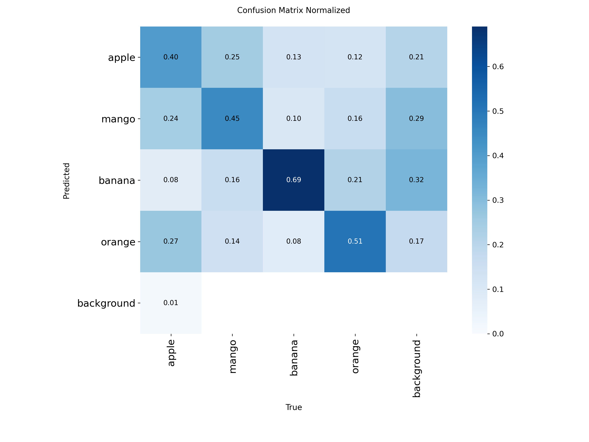
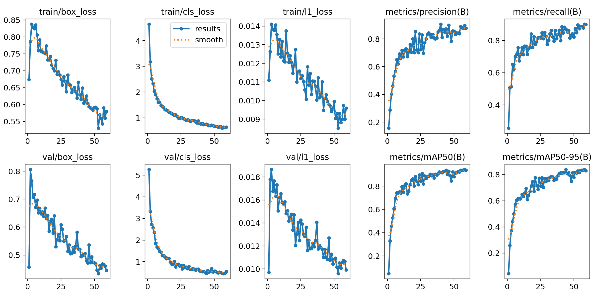
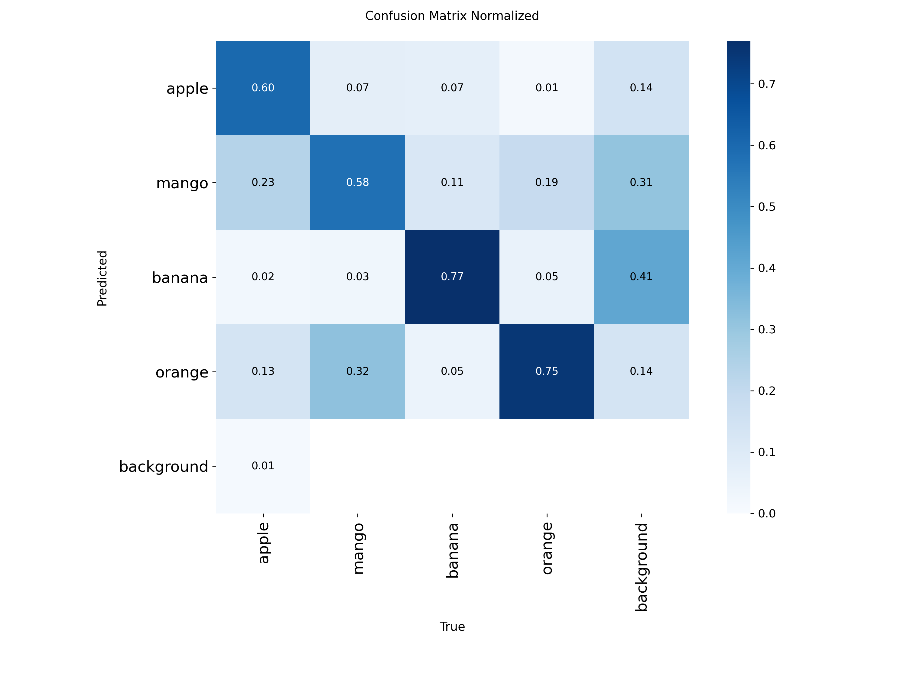

# 🍎 Real-Time Fruit Detection and Counting Using YOLO

An end-to-end computer vision project for detecting, classifying, and counting fruits in real time using a webcam.

The project covers the complete object detection workflow: **data collection, annotation cleanup, preprocessing, dataset construction, model training, evaluation, model comparison, and real-time deployment**.

Two YOLO models — **YOLO11n** and **YOLO26n** — were trained and evaluated under comparable settings. Based on held-out test performance, **YOLO11n was selected as the final model** for the real-time webcam application.

---

## Table of Contents

- [Project Overview](#project-overview)
- [Project Objectives](#project-objectives)
- [Supported Classes](#supported-classes)
- [Project Workflow](#project-workflow)
- [Dataset](#dataset)
- [Data Preprocessing](#data-preprocessing)
- [Models](#models)
- [Results](#results)
- [Demo](#demo)

---

# 🔍 Project Overview

This project was developed for **educational purposes** to explore the complete lifecycle of a computer vision object detection system.

The primary goal is to build a system capable of detecting and classifying multiple fruits from **live webcam footage** and displaying the number of detected fruits in the current frame.

The project includes:

- Data collection from multiple sources
- Custom real-world image collection
- Data annotation review
- Bounding-box cleanup
- Filename normalization
- Dataset balancing
- Train/validation/test splitting
- Training YOLO11n
- Training YOLO26n
- Evaluation on a held-out test set
- Comparison between both models
- Selection of the best-performing model
- Real-time webcam inference
- Per-class fruit counting
- Total fruit counting

The project currently supports four fruit classes:

**Apple, Mango, Banana, and Orange.**

---

# 🎯 Project Objectives

The main objectives of this project are to:

1. Build an end-to-end object detection pipeline for fruit recognition.
2. Detect multiple fruit types in real-world images.
3. Detect multiple fruits simultaneously within the same image.
4. Compare two YOLO architectures under similar training and evaluation settings.
5. Evaluate both models using a held-out test set.
6. Select the better-performing model based on quantitative metrics.
7. Deploy the selected model for real-time webcam inference.
8. Count detected fruits by class and display the total number of detections.
9. Study the challenges involved in moving from dataset-based evaluation to real-world webcam input.

---

# 🍊 Supported Classes

The dataset uses four object classes:

| Class ID | Fruit |
|---:|---|
| `0` | Apple |
| `1` | Mango |
| `2` | Banana |
| `3` | Orange |

The class IDs are used throughout the YOLO annotations and model training process.

---

# 🔄 Project Workflow

The overall project pipeline is:

```text
        Kaggle Dataset
               │
               │
        Roboflow Dataset
               │
               │
    Internet-Collected Images
               │
               │
 Custom Webcam Data Collection
               │
               ▼
      Annotation Review
               │
               ▼
    Bounding-Box Cleanup
               │
               ▼
    Filename Normalization
               │
               ▼
       Dataset Merging
               │
               ▼
     Dataset Balancing
               │
               ▼
   Train / Validation / Test
               │
          ┌────┴────┐
          ▼         ▼
      YOLO11n    YOLO26n
          │         │
          ▼         ▼
       Training   Training
          │         │
          ▼         ▼
      Best.pt    Best.pt
          │         │
          └────┬────┘
               ▼
      Held-Out Test Set
               │
               ▼
       Model Comparison
               │
               ▼
     YOLO11n Selected
               │
               ▼
     Real-Time Webcam
               │
               ▼
 Detection + Classification
               │
               ▼
 Per-Class & Total Counting
```

---

# 📊 Dataset

## Data Sources

The dataset was constructed from several sources to improve diversity and expose the models to different environments, backgrounds, lighting conditions, fruit appearances, and object combinations.

### 1. Kaggle Dataset

Part of the data was obtained from the **Fruits Images Dataset (Object Detection)** available on Kaggle.

Dataset:

**Fruits Images Dataset – Object Detection**

https://www.kaggle.com/datasets/afsananadia/fruits-images-dataset-object-detection

The downloaded data contained fruit images and their corresponding object detection annotations.

---

### 2. Roboflow Data

Additional annotated fruit images were obtained and processed using **Roboflow**.

Roboflow was also used during the annotation review process to inspect and verify bounding boxes before preparing the final dataset.

The exact original Roboflow project source is no longer available, so no specific source URL is claimed here.

---

### 3. Manually Collected Internet Images

Additional fruit images were manually collected from public internet image searches, including sources discovered through Google Images.

These images were used during dataset development to increase visual diversity.

> **Note:** Images discovered through public search engines may remain subject to their original owners' copyright and licensing terms.

---

### 4. Personally Collected Webcam Images

Additional real-world images were captured using a webcam.

In particular, mango images were collected while holding a mango in front of the camera. This helped introduce examples that more closely resemble the environment in which the final real-time detector would operate.

Negative/background images containing **no target fruit** were also captured.

These negative samples were useful for exposing the detector to scenes where none of the four target classes were present.

Some personally collected images were intentionally excluded from the public repository for privacy.

---

## Dataset Composition

During development, the dataset was balanced to approximately **175 single-fruit images per class** before the addition/consideration of mixed-fruit and negative examples.

The privacy-safe dataset currently made public contains:

| Category | Public Images |
|---|---:|
| Apple-only | 175 |
| Mango-only | 153 |
| Banana-only | 175 |
| Orange-only | 175 |
| Mixed-fruit | 39 |
| Negative/background | 0 |
| **Total** | **717** |

The mango count is lower in the public version because personally collected mango images were intentionally excluded for privacy.

The **39 mixed-fruit images** contain more than one fruit and are useful for evaluating the model's ability to detect multiple objects/classes in the same scene.

> The numbers above represent **image counts**, not the number of annotated object instances. A mixed-fruit image may contain multiple annotated fruits.

---

## Dataset Split

The final dataset was divided approximately using:

| Split | Percentage |
|---|---:|
| Training | ~70% |
| Validation | ~20% |
| Test | ~10% |

The training split was used for model optimization, the validation split was used during training, and the test split was reserved for final model evaluation.

---

## Privacy and Public Dataset

> [!IMPORTANT]
> **The publicly available dataset is not identical to the complete local dataset used for the reported experiments.**

The models reported in this repository were trained using the complete local dataset, which included additional personally collected webcam images.

Some of these images were intentionally removed from the public GitHub repository to protect personal privacy.

In particular:

- Personally collected mango images were partially excluded.
- Personally collected negative/background images were excluded.
- The trained models were created **before** these privacy-related exclusions.

Therefore, the dataset publicly available in this repository should be considered a **privacy-safe subset** of the original experimental dataset.

As a result, retraining exclusively on the public dataset may not reproduce the reported metrics exactly.

---

# 🧹 Data Preprocessing

Several preprocessing scripts were created to prepare data from different sources before training.

## `Capturing_Mango_Images.py`

This script was developed to capture additional mango images directly from a webcam.

The images were collected while holding a mango in front of the camera.

### Purpose

- Increase the number of real-world mango examples.
- Introduce webcam-style lighting and backgrounds.
- Reduce the difference between training images and real webcam input.
- Increase dataset diversity.

---

## `Capturing_Negative_Images.py`

This script captures webcam images where **none of the target fruits are present**.

### Purpose

Negative images help expose the detector to background-only scenes and can help reduce false detections when the target objects are absent.

The personally captured negative images used during development are not included in the public dataset for privacy reasons.

---

## `Fixing_Kaggle_Data.py`

This script cleans and standardizes the Kaggle-derived data after annotation review.

It was used to:

- Process annotation coordinates.
- Remove/fix excess coordinate information where required.
- Standardize the annotations for the final YOLO dataset.
- Rename files into a consistent naming structure.

---

## `Fixing_Roboflow_Data.py`

This script performs similar cleanup for data exported after the Roboflow annotation/review workflow.

It was used to:

- Clean annotation coordinates.
- Standardize label information.
- Normalize filenames.
- Prepare the data for integration into the final dataset.

---

# 🏷️ Annotation Format

The project uses the **YOLO object detection annotation format**.

A typical YOLO label follows:

```text
class_id x_center y_center width height
```

The bounding-box coordinates are normalized relative to the image dimensions.

Example:

```text
0 0.512 0.476 0.341 0.428
```

where `0` corresponds to the **Apple** class.

---

# 🤖 Models

Two lightweight YOLO object detection models were investigated:

### YOLO11n

Initialized from:

```text
yolo11n.pt
```

### YOLO26n

Initialized from:

```text
yolo26n.pt
```

Both models started from pretrained Ultralytics weights and were fine-tuned on the fruit detection dataset.

The trained model checkpoints included in this repository are located in:

```text
Models/
├── Yolo11.pt
└── Yolo26.pt
```

---

# ⚙️ Training Configuration

Both models were trained using comparable configurations to provide a fair experimental comparison.

| Parameter | YOLO11n | YOLO26n |
|---|---:|---:|
| Pretrained initialization | `yolo11n.pt` | `yolo26n.pt` |
| Maximum epochs | 100 | 100 |
| Early stopping patience | 15 | 15 |
| Input image size | 640 | 640 |
| Batch size | 8 | 8 |
| Optimizer | Auto | Auto |
| Training framework | Ultralytics | Ultralytics |
| Training plots | Enabled | Enabled |

Early stopping was enabled with a patience value of 15, allowing training to terminate when validation performance stopped improving for the specified period.

Using comparable configurations allows the final model comparison to focus primarily on their observed detection performance.

---

# 🧪 Evaluation Methodology

The final model comparison was performed using the **best checkpoint obtained during training** for each model.

The checkpoints were evaluated specifically on the held-out **test split**:

```python
metrics = model.val(
    data="Data/Final_data/data.yaml",
    split="test",
    imgsz=640,
    batch=8
)
```

Both models were evaluated using:

- The same held-out test data
- `640` image size
- Batch size of `8`
- The same Ultralytics evaluation pipeline

The primary metrics were:

### Precision

Measures how many predicted detections were correct.

### Recall

Measures how many ground-truth objects were successfully detected.

### mAP@50

Mean Average Precision using an IoU threshold of 0.50.

### mAP@50–95

Mean Average Precision averaged across IoU thresholds from 0.50 to 0.95.

mAP@50–95 provides a stricter overall assessment of object detection and bounding-box localization quality.

---

# 📈 Results

## YOLO11n vs YOLO26n

The final models were compared on the held-out test set.

| Model | Precision | Recall | mAP@50 | mAP@50–95 | Final Decision |
|---|---:|---:|---:|---:|---|
| **YOLO11n** | **0.8950** | 0.9091 | **0.9466** | **0.8788** | ✅ **Selected** |
| YOLO26n | 0.8503 | **0.9198** | 0.9218 | 0.8400 | Comparison model |

YOLO26n achieved the highest recall, while YOLO11n achieved higher:

- Precision
- mAP@50
- mAP@50–95

---

## YOLO11n Per-Class Performance

The selected YOLO11n model achieved the following test-set mAP@50–95 values:

| Class | mAP@50–95 |
|---|---:|
| Apple | 0.8920 |
| Mango | 0.8625 |
| Banana | 0.7698 |
| Orange | **0.9909** |

Orange achieved the strongest class-level result, while banana was the most challenging of the four classes according to mAP@50–95.

---

## Model Selection

### 🏆 YOLO11n was selected as the final model.

Although YOLO26n achieved slightly higher recall:

```text
YOLO26n Recall = 0.9198
YOLO11n Recall = 0.9091
```

YOLO11n achieved stronger results across the other primary evaluation metrics:

```text
Precision
YOLO11n = 0.8950
YOLO26n = 0.8503

mAP@50
YOLO11n = 0.9466
YOLO26n = 0.9218

mAP@50-95
YOLO11n = 0.8788
YOLO26n = 0.8400
```

Based on its stronger **overall held-out test performance**, YOLO11n was chosen as the final model for the real-time webcam application.

---

# 📉 Training and Evaluation Artifacts

Training artifacts for both experiments are available inside the `runs/` directory.

Each model contains:

```text
args.yaml
BoxF1_curve.png
BoxP_curve.png
BoxPR_curve.png
BoxR_curve.png
confusion_matrix.png
confusion_matrix_normalized.png
labels.jpg
results.csv
results.png
```

### Artifact Description

| File | Description |
|---|---|
| `args.yaml` | Training/experiment configuration |
| `results.csv` | Epoch-by-epoch training metrics |
| `results.png` | Visualization of training and validation metrics |
| `BoxF1_curve.png` | F1 score versus confidence |
| `BoxP_curve.png` | Precision versus confidence |
| `BoxR_curve.png` | Recall versus confidence |
| `BoxPR_curve.png` | Precision-recall curve |
| `confusion_matrix.png` | Detection confusion matrix |
| `confusion_matrix_normalized.png` | Normalized confusion matrix |
| `labels.jpg` | Visualization of dataset label characteristics |

---

## YOLO11n Training Results



### YOLO11n Normalized Confusion Matrix



### YOLO11n Precision-Recall Curve


---

## YOLO26n Training Results



### YOLO26n Normalized Confusion Matrix



### YOLO26n Precision-Recall Curve


---

# 📹 Real-Time Webcam Application

After model comparison, YOLO11n was integrated into a real-time webcam application using **OpenCV**.

The application:

- Opens the default webcam.
- Requests a camera resolution of `1920 × 1080`.
- Requests up to `60 FPS` when supported by the camera.
- Performs YOLO inference using an image size of `640`.
- Uses a confidence threshold of `0.40`.
- Draws predicted bounding boxes.
- Displays predicted class labels.
- Counts detections for each fruit class.
- Displays the total number of detected fruits.
- Supports fullscreen display.
- Runs continuously until the user exits.

### Webcam Pipeline

```text
Webcam
   │
   ▼
Capture Frame
   │
   ▼
YOLO11n Inference
   │
   ▼
Confidence Filtering
   │
   ▼
Bounding Boxes + Class Predictions
   │
   ▼
Count Predictions by Class
   │
   ▼
Calculate Total Detections
   │
   ▼
Display Annotated Frame
```

---

## Detection Settings

| Setting | Value |
|---|---:|
| Selected model | YOLO11n |
| Confidence threshold | 0.40 |
| Inference image size | 640 |
| Requested camera width | 1920 |
| Requested camera height | 1080 |
| Requested camera FPS | 60 |
| Default camera ID | 0 |

> Actual camera resolution and FPS depend on the webcam hardware and driver.

---

## Controls

| Key | Action |
|---|---|
| `Q` | Quit the application |
| `F` | Toggle fullscreen mode |

---

## Counting Behavior

The application counts detections independently in each webcam frame.

For example:

```text
APPLE : 2
BANANA : 1
ORANGE : 1

TOTAL : 4
```

Only fruit classes detected in the current frame are displayed in the counting panel.

> **Important:** This is frame-level object counting, not persistent multi-object tracking. Objects are not assigned persistent IDs between frames.

---

# 🎬 Demo

A demonstration of the real-time fruit detection system is available here:

**[▶ Watch the Fruit Detection Demo](Demo/Fruit-Detection.mp4)**

The demo shows the selected **YOLO11n model** performing real-time webcam inference, including:

- Fruit detection
- Bounding-box visualization
- Fruit classification
- Multiple-object detection
- Per-class counting
- Total detection counting

---

# 📁 Repository Structure

```text
Fruit-Detection/
│
├── Data/
│   │
│   ├── Collected_Data/
│   │   └── [collected images]
│   │
│   ├── Kaggle_Data/
│   │   ├── images/
│   │   │   ├── train/
│   │   │   ├── val/
│   │   │   └── test/
│   │   │
│   │   └── labels/
│   │       ├── train/
│   │       ├── val/
│   │       └── test/
│   │
│   ├── Roboflow_Data/
│   │   ├── train/
│   │   ├── valid/
│   │   └── test/
│   │
│   └── Final_data/
│       ├── train/
│       ├── val/
│       ├── test/
│       └── data.yaml
│
├── Demo/
│   └── Fruit-Detection.mp4
│
├── Models/
│   ├── Yolo11.pt
│   └── Yolo26.pt
│
├── Preprocessing/
│   ├── Capturing_Mango_Images.py
│   ├── Capturing_Negative_Images.py
│   ├── Fixing_Kaggle_Data.py
│   └── Fixing_Roboflow_Data.py
│
├── runs/
│   │
│   ├── Yolo11n/
│   │   ├── args.yaml
│   │   ├── BoxF1_curve.png
│   │   ├── BoxP_curve.png
│   │   ├── BoxPR_curve.png
│   │   ├── BoxR_curve.png
│   │   ├── confusion_matrix.png
│   │   ├── confusion_matrix_normalized.png
│   │   ├── labels.jpg
│   │   ├── results.csv
│   │   └── results.png
│   │
│   └── Yolo26n/
│       ├── args.yaml
│       ├── BoxF1_curve.png
│       ├── BoxP_curve.png
│       ├── BoxPR_curve.png
│       ├── BoxR_curve.png
│       ├── confusion_matrix.png
│       ├── confusion_matrix_normalized.png
│       ├── labels.jpg
│       ├── results.csv
│       └── results.png
│
├── Scripts/
│   ├── Evaluation_yolo11.py
│   ├── Evaluation_yolo26.py
│   ├── Train_yolo11.py
│   ├── Train_yolo26.py
│   └── Webcam.py
│
├── requirements.txt
├── README.md
└── .gitignore
```

> Some raw/source data may be intentionally excluded from the public repository depending on privacy and source-licensing restrictions. The structure above documents the project's development organization; the public repository may contain only the distributable subset.

---

# 📂 Directory Description

| Directory | Purpose |
|---|---|
| `Data/` | Dataset sources and final processed YOLO dataset |
| `Data/Collected_Data/` | Additional manually collected images |
| `Data/Kaggle_Data/` | Data derived from the Kaggle object detection dataset |
| `Data/Roboflow_Data/` | Data processed/reviewed through Roboflow |
| `Data/Final_data/` | Final train/validation/test dataset used by the pipeline |
| `Demo/` | Real-time application demonstration |
| `Models/` | Trained YOLO model checkpoints |
| `Preprocessing/` | Dataset collection, cleanup, and preprocessing scripts |
| `runs/` | Training/evaluation metrics and generated visualizations |
| `Scripts/` | Training, evaluation, and real-time inference scripts |

---

# 💻 Installation

## 1. Clone the Repository

```bash
git clone https://github.com/mark-360/Fruit-Detection.git
cd Fruit-Detection
```

---

## 2. Create a Virtual Environment

Creating a virtual environment is recommended.

### Windows

```bash
python -m venv .venv
.venv\Scripts\activate
```

### Linux/macOS

```bash
python3 -m venv .venv
source .venv/bin/activate
```

---

## 3. Install Dependencies

```bash
pip install -r requirements.txt
```

The main dependencies are:

```text
ultralytics
opencv-python
```

---

# 🚀 Usage

## Real-Time Webcam Detection

The final application uses the trained YOLO11n model.

Run:

```bash
python Scripts/Webcam.py
```

Then:

```text
Q → Quit
F → Toggle Fullscreen
```

---

## Train YOLO11n

```bash
python Scripts/Train_yolo11.py
```

---

## Train YOLO26n

```bash
python Scripts/Train_yolo26.py
```

---

## Evaluate YOLO11n

```bash
python Scripts/Evaluation_yolo11.py
```

---

## Evaluate YOLO26n

```bash
python Scripts/Evaluation_yolo26.py
```

---

# 🧩 Scripts

## Training Scripts

### `Scripts/Train_yolo11.py`

Loads pretrained YOLO11n weights and fine-tunes the model on the fruit detection dataset.

Main configuration:

```text
Epochs: 100
Patience: 15
Image size: 640
Batch size: 8
Optimizer: Auto
```

### `Scripts/Train_yolo26.py`

Performs the equivalent training experiment using YOLO26n under comparable settings.

---

## Evaluation Scripts

### `Scripts/Evaluation_yolo11.py`

Loads the best YOLO11n training checkpoint and evaluates it on the held-out test split.

Reports:

- Precision
- Recall
- mAP@50
- mAP@50–95
- Per-class mAP@50–95

### `Scripts/Evaluation_yolo26.py`

Performs the equivalent held-out test evaluation for YOLO26n.

---

## Real-Time Application

### `Scripts/Webcam.py`

Runs the selected YOLO11n model against live webcam frames.

Features include:

- Live object detection
- Bounding-box visualization
- Confidence filtering
- Per-class counting
- Total detection counting
- Fullscreen mode
- Keyboard controls

---

## Preprocessing Scripts

### `Preprocessing/Capturing_Mango_Images.py`

Captures custom real-world mango images using a webcam.

### `Preprocessing/Capturing_Negative_Images.py`

Captures background/negative webcam images containing no target fruits.

### `Preprocessing/Fixing_Kaggle_Data.py`

Cleans annotation coordinates and normalizes filenames for Kaggle-derived data.

### `Preprocessing/Fixing_Roboflow_Data.py`

Cleans and standardizes data exported from the Roboflow annotation workflow.

---

# 🛠️ Technologies Used

- **Python**
- **Ultralytics YOLO**
- **YOLO11n**
- **YOLO26n**
- **OpenCV**
- **Computer Vision**
- **Object Detection**
- **Transfer Learning / Fine-Tuning**
- **Roboflow**
- **Git**
- **GitHub**

---

# ⚠️ Limitations

Although the models achieved strong results on the held-out test set, several limitations remain.

### 1. Limited Number of Classes

The detector currently supports only:

- Apple
- Mango
- Banana
- Orange

Other fruits are outside the model's intended class set.

### 2. Dataset Size

The dataset is relatively small compared with large-scale production object detection datasets.

Greater variation in:

- Lighting
- Camera quality
- Backgrounds
- Fruit sizes
- Viewing angles
- Occlusion
- Fruit varieties

could improve generalization.

### 3. Public Dataset Difference

Some personally collected training data was removed from the public repository for privacy.

Therefore, the publicly available dataset is not an exact copy of the complete dataset used to generate the reported model results.

---
# 📜 Data Attribution and Usage

This repository combines data from multiple sources, including:

- The Kaggle **Fruits Images Dataset (Object Detection)**
- Data processed through Roboflow
- Images manually collected from public internet searches
- Personally captured webcam images used during local experimentation

Kaggle source:

https://www.kaggle.com/datasets/afsananadia/fruits-images-dataset-object-detection

The original Roboflow source URL is not currently available.

Images obtained from third-party sources remain subject to their respective original licenses, copyright, and usage conditions.

Some personally captured data used during model development has intentionally **not** been published for privacy reasons.

The inclusion of a third-party image in the development workflow should not be interpreted as a claim of ownership over that image.

---

# 📌 Summary

This project demonstrates an end-to-end object detection workflow covering:

```text
Data Collection
      ↓
Data Cleaning
      ↓
Annotation Preparation
      ↓
Dataset Balancing
      ↓
YOLO11n + YOLO26n Training
      ↓
Held-Out Test Evaluation
      ↓
Model Comparison
      ↓
YOLO11n Selection
      ↓
Real-Time Webcam Detection
      ↓
Fruit Classification + Counting
```

The final comparison showed that **YOLO11n provided the strongest overall test performance**, reaching:

- **Precision:** 0.8950
- **Recall:** 0.9091
- **mAP@50:** 0.9466
- **mAP@50–95:** 0.8788

It was therefore selected for the final real-time fruit detection and counting application.
