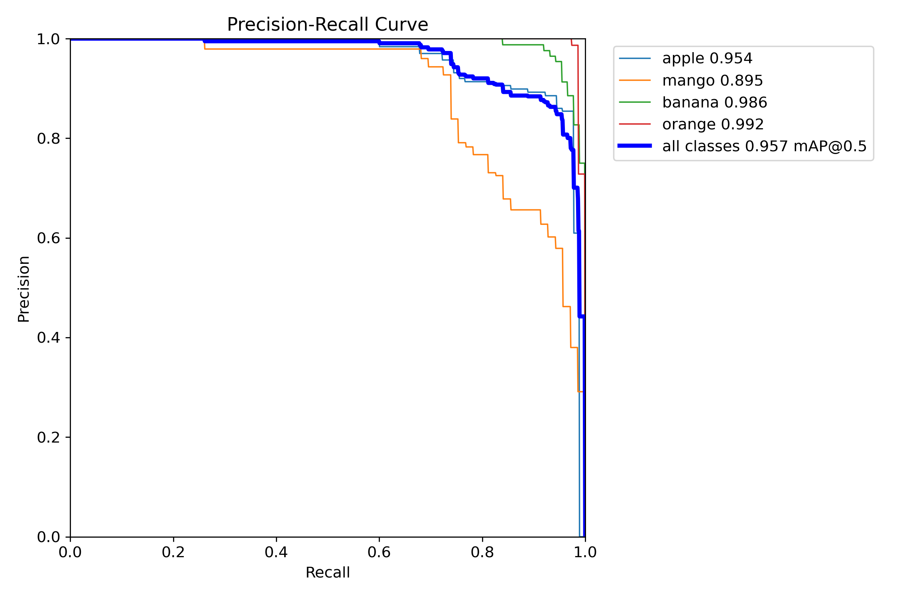
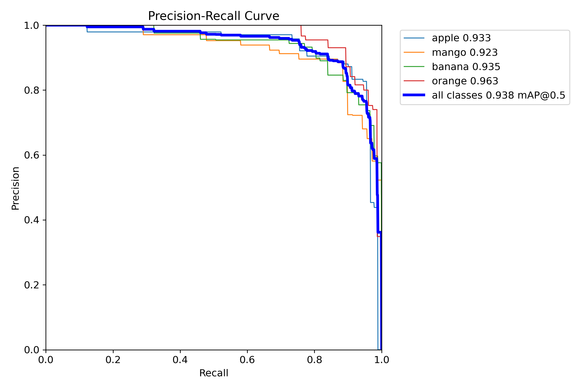

# 🍎 Real-Time Fruit Detection and Counting Using YOLO

An end-to-end computer vision project for **detecting, classifying, and counting fruits in real time using a webcam**.

The project covers the complete object detection workflow: **data collection, preprocessing, model training, held-out test evaluation, model comparison, and real-time deployment** using **Ultralytics YOLO and OpenCV**.

### Supported Classes

**🍎 Apple · 🥭 Mango · 🍌 Banana · 🍊 Orange**

---

## Key Results

Two lightweight YOLO models — **YOLO11n** and **YOLO26n** — were trained under comparable settings and evaluated on the same held-out test set.

| Model | Precision | Recall | mAP@50 | mAP@50–95 |
|---|---:|---:|---:|---:|
| **YOLO11n 🏆** | **0.8950** | 0.9091 | **0.9466** | **0.8788** |
| YOLO26n | 0.8503 | **0.9198** | 0.9218 | 0.8400 |

### 🏆 Selected Model: YOLO11n

Although YOLO26n achieved slightly higher recall, **YOLO11n achieved higher precision, mAP@50, and mAP@50–95**.

Based on its stronger overall performance on the held-out test set, **YOLO11n was selected as the final model for the real-time webcam application**.

### YOLO11n Per-Class Performance

| Class | mAP@50–95 |
|---|---:|
| Apple | 0.8920 |
| Mango | 0.8625 |
| Banana | 0.7698 |
| Orange | **0.9909** |

Orange achieved the strongest class-level performance, while banana was the most challenging of the four classes.

---

## Repository Structure

The repository is organized to separate the dataset, preprocessing pipeline, trained models, experiment results, application scripts, and demonstration files.

```text
Fruit-Detection/
│
├── Data/
│   ├── Collected_Data/
│   │   └── [collected images]
│   │
│   ├── Kaggle_Data/
│   │   ├── images/
│   │   │   ├── train/
│   │   │   ├── val/
│   │   │   └── test/
│   │   └── labels/
│   │       ├── train/
│   │       ├── val/
│   │       └── test/
│   │
│   ├── Roboflow_Data/
│   │   ├── train/
│   │   ├── valid/
│   │   └── test/
│   │
│   └── Final_data/
│       ├── train/
│       ├── val/
│       ├── test/
│       └── data.yaml
│
├── Demo/
│   └── Fruit-Detection.mp4
│
├── Models/
│   ├── Yolo11.pt
│   └── Yolo26.pt
│
├── Preprocessing/
│   ├── Capturing_Mango_Images.py
│   ├── Capturing_Negative_Images.py
│   ├── Fixing_Kaggle_Data.py
│   └── Fixing_Roboflow_Data.py
│
├── runs/
│   ├── yolo11n/
│   │   ├── args.yaml
│   │   ├── BoxF1_curve.png
│   │   ├── BoxP_curve.png
│   │   ├── BoxPR_curve.png
│   │   ├── BoxR_curve.png
│   │   ├── confusion_matrix.png
│   │   ├── confusion_matrix_normalized.png
│   │   ├── labels.jpg
│   │   ├── results.csv
│   │   └── results.png
│   │
│   └── yolo26n/
│       ├── args.yaml
│       ├── BoxF1_curve.png
│       ├── BoxP_curve.png
│       ├── BoxPR_curve.png
│       ├── BoxR_curve.png
│       ├── confusion_matrix.png
│       ├── confusion_matrix_normalized.png
│       ├── labels.jpg
│       ├── results.csv
│       └── results.png
│
├── Scripts/
│   ├── Evaluation_yolo11.py
│   ├── Evaluation_yolo26.py
│   ├── Train_yolo11.py
│   ├── Train_yolo26.py
│   └── Webcam.py
│
├── requirements.txt
├── README.md
└── .gitignore
```

> Some locally used data was intentionally excluded from the public repository for privacy and source-distribution considerations.

---

## 🎬 Demo

The final application uses the selected **YOLO11n model** to perform real-time fruit detection and counting from webcam footage.

### ▶ [Watch the Real-Time Fruit Detection Demo](Demo/Fruit-Detection.mp4)

The demo demonstrates:

- Real-time fruit detection
- Bounding-box visualization
- Fruit classification
- Multiple-object detection
- Per-class fruit counting
- Total detection counting

---

## Project Overview

This project was developed for **educational purposes** to explore the complete lifecycle of a computer vision object detection system.

The goal was not only to train an object detector, but to build an end-to-end pipeline capable of taking data from multiple sources, preparing it for training, comparing different YOLO models, and deploying the selected model in a real webcam environment.

The final system can detect and classify multiple fruits appearing simultaneously in a webcam frame and display both **per-class counts and the total number of detections**.

### Project Workflow

```text
        Kaggle Dataset
               │
        Roboflow Dataset
               │
    Internet-Collected Images
               │
    Custom Webcam Images
               │
               ▼
      Annotation Review
               │
               ▼
       Data Preprocessing
               │
               ▼
   Dataset Merging & Balancing
               │
               ▼
   Train / Validation / Test
               │
          ┌────┴────┐
          ▼         ▼
      YOLO11n    YOLO26n
          │         │
          ▼         ▼
       Training   Training
          │         │
          ▼         ▼
    Best Model   Best Model
          │         │
          └────┬────┘
               ▼
      Held-Out Test Set
               │
               ▼
       Model Comparison
               │
               ▼
      YOLO11n Selected
               │
               ▼
     Real-Time Webcam
               │
               ▼
 Detection + Classification
               │
               ▼
      Fruit Counting
```

---

## Dataset

### Classes

The project uses four YOLO object classes:

| Class ID | Fruit |
|---:|---|
| `0` | Apple |
| `1` | Mango |
| `2` | Banana |
| `3` | Orange |

### Data Sources

The dataset was constructed from multiple sources to increase visual diversity and expose the models to different fruit appearances, backgrounds, environments, and object combinations.

#### Kaggle

Part of the dataset was obtained from the **Fruits Images Dataset (Object Detection)** available on Kaggle:

**Dataset:**  
https://www.kaggle.com/datasets/afsananadia/fruits-images-dataset-object-detection

#### Roboflow

Additional annotated fruit data was obtained and processed through **Roboflow**.

Roboflow was also used during the annotation review workflow to inspect and verify the data before preparation of the final dataset.

The exact original Roboflow project URL is no longer available, so no specific source URL is claimed in this repository.

#### Internet-Collected Images

Additional fruit images were manually collected from public internet image searches to increase visual diversity.

#### Custom Webcam Images

Additional real-world images were captured using a webcam.

Mango images were captured while holding a mango in front of the camera. This provided examples that more closely resemble the environment in which the final real-time detector operates.

Negative/background images containing **none of the target fruits** were also captured during development.

---

### Public Dataset Composition

During development, the single-fruit portion of the dataset was balanced to approximately **175 images per fruit class**.

After privacy-related exclusions, the public dataset currently contains:

| Category | Public Images |
|---|---:|
| Apple-only | 175 |
| Mango-only | 153 |
| Banana-only | 175 |
| Orange-only | 175 |
| Mixed-fruit | 39 |
| Negative/background | 0 |
| **Total Public Images** | **717** |

The **39 mixed-fruit images** contain more than one fruit and help expose the detector to scenes containing multiple objects or classes simultaneously.

> These numbers represent image counts rather than annotated object-instance counts. A mixed-fruit image may contain several annotated objects.

### Dataset Split

The dataset was divided approximately into:

| Split | Percentage |
|---|---:|
| Training | ~70% |
| Validation | ~20% |
| Test | ~10% |

The training set was used for optimization, the validation set was used during training, and the test set was reserved for final model evaluation.

---

### 🔒 Privacy Note

> **The publicly available dataset is not identical to the complete local dataset used for the reported experiments.**

The models reported in this repository were trained using the complete local dataset, which included additional personally collected webcam images.

Some personally collected mango images and negative/background images were intentionally excluded from the public GitHub repository to protect personal privacy.

The trained models and reported experimental results were produced **before these privacy-related exclusions**.

Therefore, the public dataset should be considered a **privacy-safe subset of the original experimental dataset**, and retraining exclusively on the public subset may not reproduce the reported metrics exactly.

---

## Data Preprocessing

Several preprocessing scripts were developed to prepare data from different sources before model training.

### Custom Data Collection

`Capturing_Mango_Images.py` was developed to capture additional real-world mango images directly from a webcam.

Its purpose was to:

- Increase real-world mango examples
- Introduce webcam-style backgrounds and lighting
- Increase dataset diversity
- Provide examples closer to the final deployment environment

`Capturing_Negative_Images.py` captures webcam scenes where none of the four target fruits are present.

Negative/background examples were used during local experimentation to expose the detector to scenes without target objects.

### Dataset Cleanup

`Fixing_Kaggle_Data.py` and `Fixing_Roboflow_Data.py` were used to clean and standardize data after annotation review.

The preprocessing included:

- Bounding-box coordinate cleanup
- Annotation standardization
- Filename normalization
- Preparation for merging into the final dataset

### Annotation Format

The final dataset uses the standard **YOLO object detection format**:

```text
class_id x_center y_center width height
```

The bounding-box coordinates are normalized relative to the image dimensions.

---

## Model Training

Two lightweight YOLO models were investigated:

- **YOLO11n**
- **YOLO26n**

Both were initialized from pretrained Ultralytics weights and fine-tuned on the fruit detection dataset.

### Training Configuration

Both experiments used comparable configurations:

| Configuration | YOLO11n | YOLO26n |
|---|---:|---:|
| Initial weights | `yolo11n.pt` | `yolo26n.pt` |
| Maximum epochs | 100 | 100 |
| Early stopping patience | 15 | 15 |
| Image size | 640 | 640 |
| Batch size | 8 | 8 |
| Optimizer | Auto | Auto |
| Framework | Ultralytics | Ultralytics |
| Training plots | Enabled | Enabled |

The trained checkpoints included in this repository are located in:

```text
Models/
├── Yolo11.pt
└── Yolo26.pt
```

---

## Evaluation Methodology

The final comparison was performed using the **best checkpoint obtained during training** for each model.

Each model was evaluated independently on the held-out **test split**.

```python
metrics = model.val(
    data="Data/Final_data/data.yaml",
    split="test",
    imgsz=640,
    batch=8
)
```

Both models therefore used the same:

- Test dataset
- Image size of `640`
- Batch size of `8`
- Ultralytics evaluation pipeline

### Evaluation Metrics

**Precision**  
Measures how many predicted detections were correct.

**Recall**  
Measures how many ground-truth objects were successfully detected.

**mAP@50**  
Mean Average Precision using an IoU threshold of 0.50.

**mAP@50–95**  
Mean Average Precision averaged across IoU thresholds from 0.50 through 0.95, providing a stricter assessment of detection and localization quality.

The final YOLO11n vs YOLO26n comparison shown at the beginning of this README is based on these **held-out test results**, rather than training performance alone.

---

## Experiment Visuals

Training and evaluation artifacts for both experiments are available in the `runs/` directory.

### YOLO11n

#### Training Results


#### Normalized Confusion Matrix


#### Precision-Recall Curve



---

### YOLO26n

#### Training Results


#### Normalized Confusion Matrix


#### Precision-Recall Curve



---

## Real-Time Webcam Application

After model comparison, the selected **YOLO11n model** was integrated with OpenCV for real-time webcam inference.

### Configuration

| Setting | Value |
|---|---:|
| Selected model | YOLO11n |
| Confidence threshold | 0.40 |
| Inference image size | 640 |
| Requested camera resolution | 1920 × 1080 |
| Requested camera FPS | 60 |
| Default camera ID | 0 |

> Actual camera resolution and FPS depend on the available webcam hardware and driver.

### Webcam Pipeline

```text
Webcam Frame
     │
     ▼
YOLO11n Inference
     │
     ▼
Confidence Filtering
     │
     ▼
Bounding Boxes + Class Predictions
     │
     ▼
Per-Class Counting
     │
     ▼
Total Detection Count
     │
     ▼
Annotated Live Display
```

The application only displays fruit classes currently detected in the frame.

Example:

```text
APPLE : 2
BANANA : 1
ORANGE : 1

TOTAL : 4
```

### Controls

| Key | Action |
|---|---|
| `Q` | Quit the application |
| `F` | Toggle fullscreen |

> **Counting behavior:** The application performs frame-level counting. It does not currently perform persistent multi-object tracking or assign persistent IDs to objects across frames.

---

## Installation and Usage

### 1. Clone the Repository

```bash
git clone https://github.com/mark-360/Fruit-Detection.git
cd Fruit-Detection
```

### 2. Create a Virtual Environment

#### Windows

```bash
python -m venv .venv
.venv\Scripts\activate
```

#### Linux / macOS

```bash
python3 -m venv .venv
source .venv/bin/activate
```

### 3. Install Dependencies

```bash
pip install -r requirements.txt
```

The primary dependencies are:

```text
ultralytics
opencv-python
```

### 4. Run Real-Time Detection

```bash
python Scripts/Webcam.py
```

### Training

Train YOLO11n:

```bash
python Scripts/Train_yolo11.py
```

Train YOLO26n:

```bash
python Scripts/Train_yolo26.py
```

### Evaluation

Evaluate YOLO11n:

```bash
python Scripts/Evaluation_yolo11.py
```

Evaluate YOLO26n:

```bash
python Scripts/Evaluation_yolo26.py
```

> Some scripts currently contain local path configuration and may require path adjustment depending on where the repository is stored.

---
## Data Attribution and Usage

This project combines data from multiple sources, including:

- The Kaggle **Fruits Images Dataset (Object Detection)**
- Data processed through Roboflow
- Images manually collected from public internet searches
- Personally captured webcam images used during local experimentation

### Kaggle Source

https://www.kaggle.com/datasets/afsananadia/fruits-images-dataset-object-detection

The exact original Roboflow project URL is no longer available.

Third-party images remain subject to their respective original licenses, copyright, and usage conditions.

Some personally captured data used during model development has intentionally **not been published** for privacy reasons.

The inclusion of third-party images in the development workflow should not be interpreted as a claim of ownership over those images.

---

## Repository Guide

This section provides a detailed explanation of the repository for anyone who wants to explore, understand, or reproduce the project.

### `Data/`

Contains the data used throughout the project.

#### `Collected_Data/`

Contains additional images manually collected during dataset development.

#### `Kaggle_Data/`

Contains data originating from the Kaggle Fruits Images Object Detection dataset.

Its structure separates images and labels into training, validation, and test splits.

#### `Roboflow_Data/`

Contains data processed through the Roboflow annotation workflow.

#### `Final_data/`

Contains the consolidated dataset prepared for YOLO training and evaluation.

```text
Final_data/
├── train/
├── val/
├── test/
└── data.yaml
```

`data.yaml` defines the dataset paths and class configuration required by Ultralytics YOLO.

---

### `Demo/`

Contains:

```text
Fruit-Detection.mp4
```

This video demonstrates the final YOLO11n model performing real-time webcam fruit detection and counting.

---

### `Models/`

Contains the trained model checkpoints:

```text
Yolo11.pt
Yolo26.pt
```

`Yolo11.pt` corresponds to the model selected for the final real-time application.

`Yolo26.pt` is retained as the comparison model.

---

### `Preprocessing/`

Contains scripts used during data collection and preparation.

#### `Capturing_Mango_Images.py`

Captures custom mango images from a webcam to provide additional real-world training examples.

#### `Capturing_Negative_Images.py`

Captures webcam scenes containing none of the target fruit classes for use as negative/background examples.

#### `Fixing_Kaggle_Data.py`

Cleans and standardizes Kaggle-derived annotations and filenames before integration into the final dataset.

#### `Fixing_Roboflow_Data.py`

Cleans and standardizes data processed through the Roboflow annotation workflow.

---

### `runs/`

Stores experiment artifacts for the two trained models:

```text
runs/
├── yolo11n/
└── yolo26n/
```

Each experiment directory contains:

| File | Purpose |
|---|---|
| `args.yaml` | Training/experiment configuration |
| `results.csv` | Epoch-by-epoch training metrics |
| `results.png` | Training and validation metric visualization |
| `BoxF1_curve.png` | F1 score vs. confidence |
| `BoxP_curve.png` | Precision vs. confidence |
| `BoxR_curve.png` | Recall vs. confidence |
| `BoxPR_curve.png` | Precision-recall curve |
| `confusion_matrix.png` | Detection confusion matrix |
| `confusion_matrix_normalized.png` | Normalized confusion matrix |
| `labels.jpg` | Dataset label visualization |

---

### `Scripts/`

Contains the main model training, evaluation, and deployment code.

#### `Train_yolo11.py`

Loads pretrained YOLO11n weights and fine-tunes the model on the fruit detection dataset.

#### `Train_yolo26.py`

Loads pretrained YOLO26n weights and performs the corresponding comparison experiment.

#### `Evaluation_yolo11.py`

Loads the best YOLO11n checkpoint and evaluates it specifically on the held-out test split.

It reports:

- Precision
- Recall
- mAP@50
- mAP@50–95
- Per-class mAP@50–95

#### `Evaluation_yolo26.py`

Performs the equivalent held-out test evaluation for YOLO26n.

#### `Webcam.py`

Runs the selected YOLO11n model against live webcam frames.

It handles:

- Webcam capture
- YOLO inference
- Bounding-box visualization
- Class prediction
- Confidence filtering
- Per-class counting
- Total detection counting
- Fullscreen display
- Keyboard controls

---
## Summary

This project demonstrates an end-to-end object detection workflow:

```text
Data Collection
      ↓
Data Cleaning & Preprocessing
      ↓
Dataset Construction
      ↓
YOLO11n + YOLO26n Training
      ↓
Held-Out Test Evaluation
      ↓
Model Comparison
      ↓
YOLO11n Selection
      ↓
Real-Time Webcam Detection
      ↓
Fruit Classification + Counting
```

### Final YOLO11n Performance

| Metric | Result |
|---|---:|
| Precision | **0.8950** |
| Recall | **0.9091** |
| mAP@50 | **0.9466** |
| mAP@50–95 | **0.8788** |

**YOLO11n was selected as the final model due to its stronger overall performance on the held-out test set and was subsequently integrated into the real-time webcam fruit detection and counting application.**
